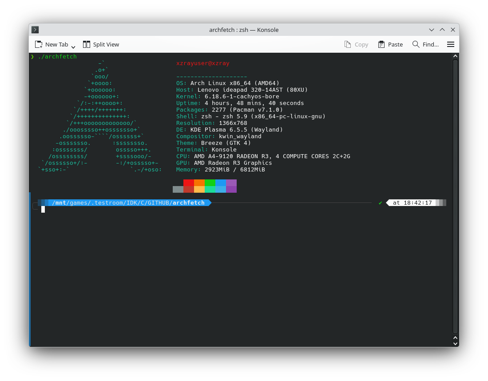

# Archfetch - System Information Fetcher for Arch Linux


Archfetch is a lightweight system information tool for Arch Linux distributions. It displays detailed system information with colorful ASCII art in a visually appealing format.



## ✨ Features
- **Complete System Overview** - Displays comprehensive system information including hardware specs, software versions, and configuration details
- **Dual Operation Modes** - Displays system information with beautiful ASCII art and color formatting in Normal Mode, and Saves static system configuration for faster subsequent runs in Configuration Mode (-fetch)
- **Fast & Lightweight** - Written in pure C with minimal dependencies (Check test.png)
- **Colorful Output** - ANSI color codes for enhanced visual appeal

## 📋 Information Displayed
**Archfetch displays the following system information:**

### System Basics
- User & Hostname: User login and system hostname
- Operating System: Arch Linux version with architecture details
- Host System: Hardware product name and version
- Kernel: Linux kernel release version
- Uptime: System uptime in human-readable format

### Software & Packages
- Package Count: Number of installed pacman packages
- Pacman Version: Package manager version
- Shell: Current shell and its version
- Desktop Environment: KDE Plasma version with session type (X11/Wayland)

### Hardware & Display
- CPU: Processor model and specifications
- GPU: Graphics card information
- Memory: Current memory usage vs total memory
- Resolution: Primary display resolution
- Terminal: Detected terminal emulator

### Configuration
- Theme: Current GTK4 theme
- Compositor: Desktop compositor details


## 🚀 Installation & Usage
### Clone
```bash
git clone https://github.com/Xzray03/archfetch
cd archfetch
```

### Compilation
```bash
chmod +x build.sh
./build.sh

or manually:
clang archfetch.c -o archfetch
gcc archfetch.c -o archfetch
```

### First-Time Setup
Before using Archfetch, you need to save your system configuration:
```bash
./archfetch -fetch
```
This creates a configuration file at ~/.config/archfetch/fetch.conf containing static system information for faster display.

### Normal Usage
Simply run the executable:
```bash
./archfetch
```

### Global Installation (Optional)
```bash
sudo cp archfetch /usr/local/bin/
```


## 📁 Configuration File
Archfetch uses a configuration file to store static system information that doesn't change frequently:
```
Location: ~/.config/archfetch/fetch.conf
```
### The configuration file stores:
- OS information
- Host details
- Kernel version
- Desktop environment
- CPU/GPU information
- Total memory
- Display resolution


## Regenerating Configuration
If your system hardware or configuration changes significantly, regenerate the configuration:
```bash
./archfetch -fetch
```


## 🔧 Technical Details
### Architecture
The program is structured into several logical sections:
1. **Utility Functions**: String trimming, file reading, command execution
2. **System Detection**: Functions to gather various system information
3. **Configuration Management**: Read/write configuration files
4. **Display Logic**: ASCII art generation and color formatting

### Key Functions
- **get_os()**: Reads /etc/os-release for OS information
- **get_host()**: Reads DMI information for hardware details
- **get_package_count()**: Counts pacman packages from /var/lib/pacman/local
- **get_memory_usage()**: Calculates memory usage from /proc/meminfo
- **get_de()**: Detects KDE Plasma version and session type
- **conf_write()**: Saves configuration for faster future runs


## ⚠️ Limitations & Compatibility (For Now)
- KDE Plasma Specific: Only compatible with KDE Plasma desktop environment
- GPU Detection: Relies on glxinfo command


## 🤝 Contributing
Contributions are welcome! Please ensure:
- Code follows the existing style and structure
- New features include appropriate documentation


## License
Apache 2.0 License - See LICENSE file for details


## Support
- 📧 Email:  xzray@proton.me
- 🐛 Issues: [GitHub Issues](https://github.com/Xzray03/archfetch/issues)
- 💬 Discussions: [GitHub Discussions](https://github.com/Xzray03/archfetch/discussions)


## Credits

Developed with ❤️ for Linux users who love fancy system fetcher.

-----------------------------------------------------------------------------

**Made with C • Open Source • Free Forever**
